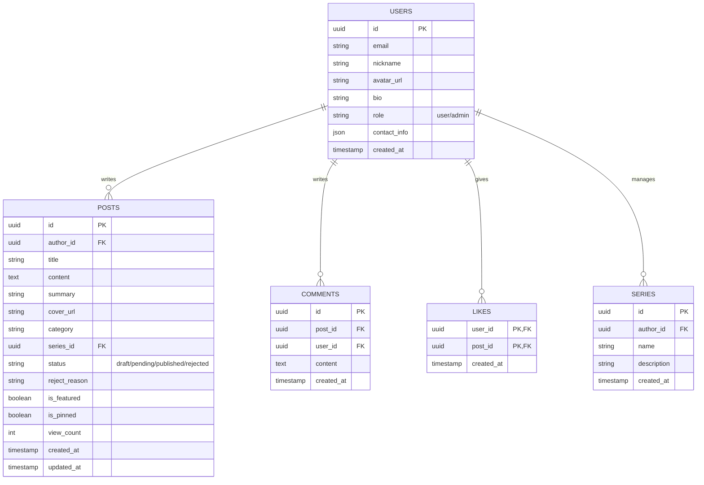

# Product Requirement Document (PRD) - ChongLangLSCrow

## 1. 目标与范围 (Goal & Scope)

**项目名称**: ChongLangLSCrow
**域名**: ChongLangLSCrow.cn
**项目描述**: 一个基于 Next.js 和 Supabase 的多用户博客网站，支持文章发布、阅读、评论、点赞及系列合集管理。
**核心目标**: 提供一个现代化、高性能、前后端分离的博客平台，支持小说、散文、诗歌等多种体裁的创作与分享。

## 2. 用户角色与权限矩阵 (User Roles & Permissions)

| 角色 | 权限描述 |
| :--- | :--- |
| **游客 (Guest)** | 浏览已发布文章（正文、评论）、搜索、查看分类、查看系列合集。不可点赞、评论、投稿。 |
| **登录用户 (User)** | 拥有游客权限。可点赞、评论文章；可投稿（Markdown）；查看自己投稿状态；创建/管理自己的系列合集；编辑/删除自己的文章和评论；修改个人资料。 |
| **管理员 (Admin)** | 拥有全部权限。包括后台管理（审核文章、用户管理、系统配置）；文章加精、置顶、隐藏、删除；评论删除；查看统计数据。 |

**权限边界**:
- 用户仅可编辑/删除自己的数据。
- 待审核/已拒绝文章仅作者和管理员可见。
- 管理员可修改任何文章状态。
- 注销账号后文章保留，作者匿名化。

## 3. 功能详细描述 (Functional Requirements)

### 3.1 主页 (Home Page)
- **顶栏**:
  - favicon (`/favicon.jpg`)
  - 网站标题
  - 日夜模式切换 (Sun/Moon 图标)
  - 搜索框
  - 共创按钮
  - 站内信箱
  - 登录/注册按钮 (未登录显示) / 用户头像 (已登录显示)
- **Hero区域**:
  - 背景图 (`/background.jpg`)，支持渐变过渡。
  - 大网站标题：正中央，下滑渐隐。
  - 引言：左上角循环显示三条 (配置在 `/config.json`)。
- **内容导航**:
  - 下滑出现六个按钮：全部、小说、散文、诗歌、关于我。
  - 点击切换下方内容。
  - "关于我"：渲染 `/about_me.md`。
- **文章列表**:
  - 卡片式展示，背景液态玻璃化。
  - 显示：标题、作者、发布时间、摘要、分割线、点赞数、评论数、加精/置顶标识。
  - 悬停效果：浮窗显示前200字纯文本。
  - 分页：每页自适应行数，最多5行，底部翻页。
- **页脚**: 常规版权信息等。

### 3.2 个人中心 (User Center)
- **我的主页**:
  - 头像 (图床URL导入)、昵称 (查重)、邮箱、电话、微信、QQ、个人简介。
  - 他人访问仅可见主页和已发布文章。
- **我的文章**: 包含已发布、待审核、已拒绝 (显示原因)。
- **我的点赞**: 跳转对应文章，支持取消点赞。
- **我的评论**: 跳转对应评论，支持删除。
- **我的投稿**: 状态标记，点击进入详情。
- **设置**: 修改密码、邮箱绑定 (如果 Supabase 支持)。

### 3.3 创作页面 (Creation Page)
- **编辑器**:
  - 标题、封面 (图床URL)、分类 (小说/散文/诗歌)、摘要、系列 (新增/删除/选择)。
  - 正文：Markdown 编辑器，图片通过图床URL导入。
- **功能**:
  - 自动保存 (30s)。
  - 草稿保存/恢复 (跨设备)。
  - 发布：提交审核，成功后跳转提示页。
- **边界情况**: 断网提示、表单验证错误高亮。

### 3.4 管理员后台 (Admin Dashboard)
- **入口**: 仅管理员可见，无权限重定向。
- **投稿审核**:
  - 列表展示待审核文章。
  - 操作：通过/拒绝 (填写原因)。
- **文章管理**:
  - 筛选：状态、分类、作者。
  - 操作：编辑、删除 (二次确认)、审核、加精、置顶、隐藏。
  - 批量操作。
- **用户管理**:
  - 列表、搜索、筛选。
  - 禁用/启用用户，授予/撤销管理员权限。
- **系列合集审核**: 查看详情。
- **统计数据**: 文章数、用户数、活动日志。
- **外链**: GitHub 仓库跳转。

### 3.5 正文页面 (Post Detail)
- **头部**: 封面背景、模糊标题、作者 (头像+昵称跳转)、元数据 (时间、热度、系列)。
- **正文**: Markdown 渲染。
- **系列导航**: 上一篇/下一篇按钮。
- **底部交互**:
  - 点赞 (登录切换)。
  - 评论区 (仅发布者/管理员可删)。
  - 分享按钮。
- **操作栏**:
  - 作者: 编辑、删除。
  - 管理员: 审核、加精、置顶。
- **边界**: 删除显404，未审核仅特定角色可见。

### 3.6 其他功能
- **分类页面**: 多级分类、标签云、筛选排序。
- **登录注册**: Supabase Auth (Email/Password)，密码强度校验，邮箱验证。
- **搜索**: 标题/作者/正文模糊搜索，按相关性/时间排序。
- **主题切换**: 深色/浅色模式 (localStorage 存储)。
- **通知**: 全局 Toast 通知，站内信箱 (审核结果、系统通知)。

## 4. 非功能需求 (Non-functional Requirements)
- **性能**: 图片懒加载，Next.js SSR/SSG 优化，CDN 加速。
- **安全**: RLS (Row Level Security) 保护数据，输入清洗防 XSS/SQL 注入。
- **可用性**: 响应式设计 (Tailwind)，适配移动/桌面端。
- **国际化**: 暂无明确要求，预留字段。
- **图标**: Lucide-react 统一风格。

## 5. 数据模型 (Data Model)

## 6. API 接口清单 (API Interface)

主要使用 Supabase Client SDK 进行交互，部分逻辑使用 Edge Functions。

- **Auth**: `signUp`, `signIn`, `signOut`, `resetPassword`.
- **User**: `getProfile`, `updateProfile`.
- **Post**:
  - `fetchPosts` (filters: category, status, etc.)
  - `getPostById`
  - `createPost`
  - `updatePost`
  - `deletePost`
- **Interaction**:
  - `likePost` / `unlikePost`
  - `createComment` / `deleteComment`
- **Admin**:
  - `adminApprovePost` / `adminRejectPost`
  - `adminPinPost` / `adminFeaturePost`

## 7. 部署与 CI/CD (Deployment)
- **Frontend**: Vercel (Auto deploy on git push).
- **Backend**: Supabase (Database, Auth, Storage, Edge Functions).
- **CI**: GitHub Actions (Lint, Build Test).

## 8. 验收标准 (Acceptance Criteria)
1. 游客无法访问需登录页面，自动跳转。
2. 文章发布流程通畅，审核机制正常工作。
3. 个人中心数据加载正确，权限隔离有效。
4. 管理员后台功能可用，无越权漏洞。
5. 移动端和桌面端布局正常，深色模式切换无闪烁。
6. 搜索功能准确，性能在接受范围内 (<1s)。

## 9. 里程碑与风险 (Milestones & Risks)
- **Phase 1**: 基础架构搭建，Auth，数据库设计。(Day 1-2)
- **Phase 2**: 核心功能 (主页、文章详情、个人中心)。(Day 3-5)
- **Phase 3**: 创作与审核流程，评论点赞。(Day 6-8)
- **Phase 4**: 管理后台，高级功能 (搜索、系列)。(Day 9-10)
- **Phase 5**: 测试，优化，部署。(Day 11-12)

**风险**:
- Supabase 免费额度限制。
- 图床外链稳定性。
- 内容审核合规性风险。
